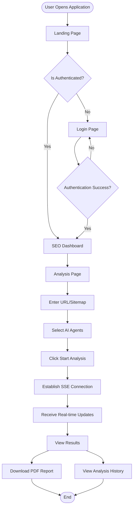
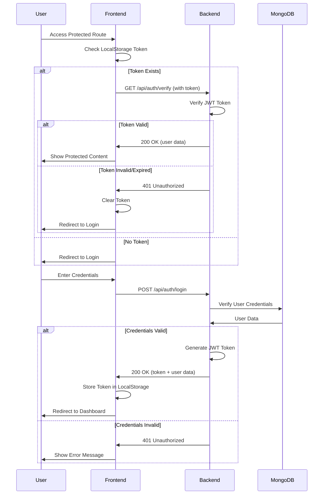
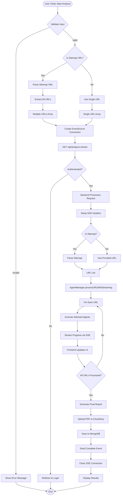
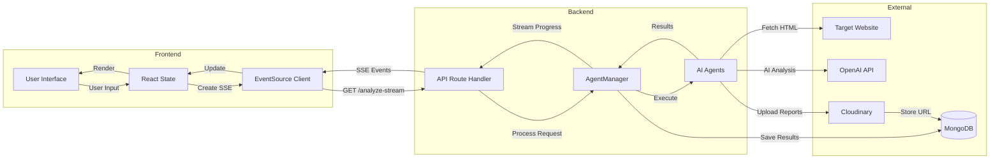
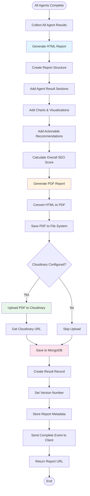
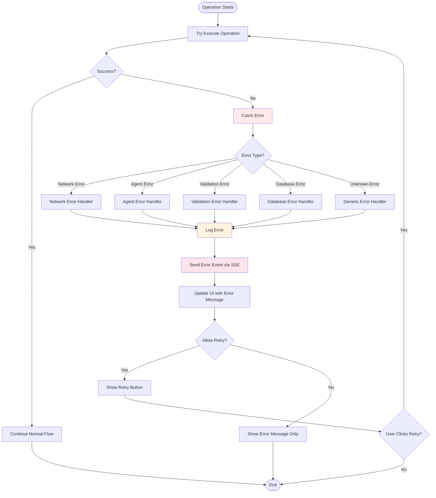
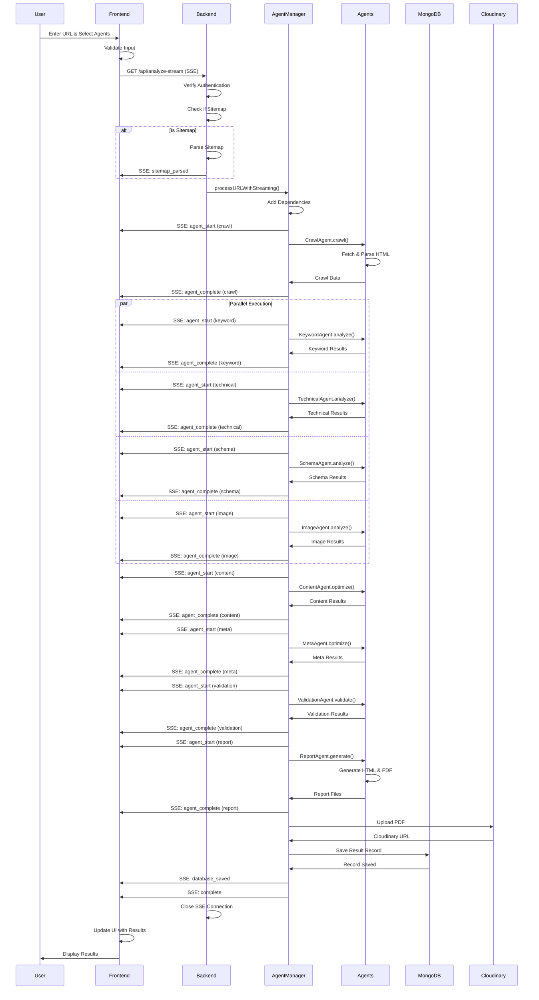

# AI SEO Ecosystem - Complete Application Flowchart

## 📋 Table of Contents
1. [What is Agentic AI?](#what-is-agentic-ai)
2. [Agentic AI in This Application](#agentic-ai-in-this-application)
3. [Micro-Agents Architecture](#micro-agents-architecture)
4. [System Architecture Overview](#system-architecture-overview)
5. [User Flow](#user-flow)
6. [Authentication Flow](#authentication-flow)
7. [Analysis Request Flow](#analysis-request-flow)
8. [Agent Execution Flow](#agent-execution-flow)
9. [Data Flow](#data-flow)
10. [Report Generation Flow](#report-generation-flow)
11. [Error Handling Flow](#error-handling-flow)

---

## What is Agentic AI?

**Agentic AI** (also known as AI Agents or Autonomous AI) refers to artificial intelligence systems that can:
- **Act autonomously** to achieve specific goals
- **Make decisions** based on their environment and context
- **Take actions** without constant human intervention
- **Learn and adapt** from their experiences
- **Collaborate** with other agents to solve complex problems

### Key Characteristics of Agentic AI:

1. **Autonomy**: Agents can operate independently once given a task
2. **Goal-Oriented**: They work towards specific objectives
3. **Reactive**: They respond to changes in their environment
4. **Proactive**: They can take initiative when needed
5. **Social**: They can communicate and collaborate with other agents
6. **Learning**: They improve their performance over time

### Agentic AI vs Traditional AI:

```
Traditional AI:
    Input → Model → Output
    (Passive, requires explicit instructions)

Agentic AI:
    Goal → Agent → Actions → Feedback → Adaptation
    (Active, autonomous decision-making)
```

---

## Agentic AI in This Application

### How We Use Agentic AI

This **AI SEO Ecosystem** is built on an **Agentic AI architecture** where multiple specialized AI agents work together autonomously to analyze and optimize websites for SEO. Here's how Agentic AI is implemented:

#### 1. **Autonomous Agent Execution**
Each agent operates independently:
- **CrawlAgent**: Automatically fetches and parses website content
- **KeywordIntelligenceAgent**: Independently analyzes keyword opportunities
- **ContentOptimizationAgent**: Makes autonomous content improvement suggestions
- **TechnicalSEOAgent**: Self-directed technical analysis
- And 11 more specialized agents...

#### 2. **Goal-Oriented Behavior**
Each agent has a specific goal:
```
CrawlAgent Goal: Extract all relevant website data
KeywordAgent Goal: Identify keyword opportunities
ContentAgent Goal: Optimize content for SEO
TechnicalAgent Goal: Ensure technical SEO compliance
...and so on
```

#### 3. **Collaborative Multi-Agent System**
Agents work together:
- Agents share data (Crawl data → All other agents)
- Agents build on each other's findings (Keyword → Content/Meta)
- Agents validate each other's work (Validation Agent)
- Agents compile results (Report Agent)

#### 4. **Adaptive Learning**
- **LearningAgent**: Continuously learns from analysis results
- Agents improve recommendations based on historical data
- Pattern recognition from multiple website analyses

#### 5. **Decision-Making Capabilities**
Agents make autonomous decisions:
- Which keywords to suggest
- What content improvements to recommend
- How to prioritize SEO issues
- What schema markup to generate

### Agentic AI Flow in Our Application

```
User Request
    │
    ▼
AgentManager (Orchestrator)
    │
    ├──► Determines which agents to activate
    ├──► Manages agent dependencies
    ├──► Coordinates agent execution
    └──► Collects and synthesizes results
         │
         ▼
    ┌─────────────────────────────────┐
    │   Autonomous Agent Execution     │
    ├─────────────────────────────────┤
    │                                   │
    │  Each agent:                     │
    │  • Receives input                │
    │  • Makes decisions               │
    │  • Performs analysis             │
    │  • Generates recommendations    │
    │  • Returns results                │
    │                                   │
    └─────────────────────────────────┘
         │
         ▼
    Results Synthesis
         │
         ▼
    User receives comprehensive SEO analysis
```

---

## Micro-Agents Architecture

### What are Micro-Agents?

**Micro-Agents** are small, specialized AI agents that:
- Focus on **one specific task** or domain
- Are **lightweight** and efficient
- Can be **composed** together to solve complex problems
- Follow the **Single Responsibility Principle**

### Our Micro-Agent Architecture

This application uses **15 specialized micro-agents**, each handling a specific aspect of SEO:

#### Core Micro-Agents (Required)

1. **CrawlAgent** 🕷️
   - **Purpose**: Extract website data
   - **Responsibility**: HTML parsing, metadata extraction, link discovery
   - **Output**: Structured crawl data

#### Analysis Micro-Agents (Parallel Execution)

2. **KeywordIntelligenceAgent** 🔑
   - **Purpose**: Keyword analysis and opportunities
   - **Responsibility**: Detect keywords, suggest missing keywords, analyze density
   - **Output**: Keyword recommendations

3. **TechnicalSEOAgent** ⚙️
   - **Purpose**: Technical SEO compliance
   - **Responsibility**: Core Web Vitals, performance, mobile-friendliness
   - **Output**: Technical recommendations

4. **SchemaAgent** 📋
   - **Purpose**: Structured data management
   - **Responsibility**: Schema detection, generation, validation
   - **Output**: Schema markup suggestions

5. **ImageIntelligenceAgent** 🖼️
   - **Purpose**: Image optimization
   - **Responsibility**: Alt text analysis, image optimization
   - **Output**: Image recommendations

#### Optimization Micro-Agents (Dependent)

6. **ContentOptimizationAgent** 📝
   - **Purpose**: Content quality improvement
   - **Responsibility**: Readability, structure, keyword placement
   - **Dependencies**: CrawlAgent, KeywordIntelligenceAgent
   - **Output**: Content optimization suggestions

7. **MetaTagAgent** 🏷️
   - **Purpose**: Meta tag optimization
   - **Responsibility**: Title and description optimization
   - **Dependencies**: CrawlAgent, KeywordIntelligenceAgent
   - **Output**: Optimized meta tags

#### Validation & Reporting Micro-Agents

8. **ValidationAgent** ✅
   - **Purpose**: Quality assurance
   - **Responsibility**: Cross-validate all findings, ensure compliance
   - **Dependencies**: All previous agents
   - **Output**: Validation report

9. **ReportAgent** 📊
   - **Purpose**: Report generation
   - **Responsibility**: Compile all results into comprehensive reports
   - **Dependencies**: All agents
   - **Output**: HTML and PDF reports

#### Advanced Micro-Agents

10. **LearningAgent** 🧠
    - **Purpose**: Continuous improvement
    - **Responsibility**: Learn from results, improve recommendations
    - **Output**: Updated knowledge base

11. **SERPAnalysisAgent** 🔍
    - **Purpose**: Search Engine Results Page analysis
    - **Responsibility**: Analyze SERP features, competitor rankings
    - **Output**: SERP insights

12. **RankTrackingAgent** 📈
    - **Purpose**: Keyword ranking tracking
    - **Responsibility**: Track keyword positions over time
    - **Output**: Ranking history

13. **CompetitorAnalysisAgent** 🏆
    - **Purpose**: Competitive analysis
    - **Responsibility**: Compare with competitors, identify gaps
    - **Output**: Competitive insights

14. **KeywordResearchAgent** 🔎
    - **Purpose**: Keyword research
    - **Responsibility**: Research keywords, analyze search volume
    - **Output**: Keyword research data

15. **BlogGeneratorAgent** ✍️
    - **Purpose**: Content generation
    - **Responsibility**: Generate SEO-optimized blog content
    - **Output**: Blog post content

### Micro-Agent Communication Pattern

```
┌─────────────────────────────────────────────────────────────┐
│              Micro-Agent Communication                       │
└─────────────────────────────────────────────────────────────┘

AgentManager (Orchestrator)
    │
    ├──► Broadcasts: Task & Context
    │
    ├──► CrawlAgent (No dependencies)
    │    └──► Publishes: CrawlData
    │
    ├──► KeywordAgent (Depends on: CrawlData)
    │    └──► Publishes: KeywordAnalysis
    │
    ├──► TechnicalAgent (Depends on: CrawlData)
    │    └──► Publishes: TechnicalAnalysis
    │
    ├──► ContentAgent (Depends on: CrawlData + KeywordAnalysis)
    │    └──► Publishes: ContentRecommendations
    │
    └──► ReportAgent (Depends on: All)
         └──► Publishes: ComprehensiveReport
```

### Benefits of Micro-Agent Architecture

1. **Modularity**: Each agent is independent and can be updated separately
2. **Scalability**: Easy to add new agents without affecting existing ones
3. **Maintainability**: Clear separation of concerns
4. **Testability**: Each agent can be tested in isolation
5. **Reusability**: Agents can be reused in different contexts
6. **Parallelization**: Independent agents can run simultaneously
7. **Fault Tolerance**: Failure of one agent doesn't break the system

### Micro-Agent Lifecycle

```
┌─────────────────────────────────────────────────────────────┐
│              Micro-Agent Lifecycle                          │
└─────────────────────────────────────────────────────────────┘

1. Initialization
   └──► Agent is instantiated with configuration

2. Task Assignment
   └──► AgentManager assigns task to agent

3. Dependency Resolution
   └──► Agent waits for required dependencies

4. Execution
   └──► Agent performs its specialized task
        ├──► Data Processing
        ├──► AI Analysis (if applicable)
        ├──► Decision Making
        └──► Result Generation

5. Result Publication
   └──► Agent publishes results for other agents

6. Learning (Optional)
   └──► Agent updates its knowledge base

7. Completion
   └──► Agent signals completion to AgentManager
```

### Example: Micro-Agent in Action

**KeywordIntelligenceAgent** as a Micro-Agent:

```javascript
// Micro-Agent Structure
class KeywordIntelligenceAgent {
  // Single Responsibility: Keyword Analysis
  
  async analyze(crawlData) {
    // 1. Autonomous Decision: Which keywords to analyze
    const keywords = this.extractKeywords(crawlData);
    
    // 2. AI-Powered Analysis: Use OpenAI for insights
    const analysis = await this.aiAnalyze(keywords);
    
    // 3. Generate Recommendations: Autonomous suggestions
    const recommendations = this.generateRecommendations(analysis);
    
    // 4. Return Results: Structured output
    return {
      detectedKeywords: keywords,
      missingKeywords: analysis.missing,
      suggestions: recommendations,
      score: this.calculateScore(analysis)
    };
  }
  
  // Agent makes autonomous decisions:
  // - What keywords are important?
  // - What keywords are missing?
  // - What should be recommended?
}
```

---

## System Architecture Overview

```
┌─────────────────────────────────────────────────────────────────┐
│                        CLIENT LAYER                              │
├─────────────────────────────────────────────────────────────────┤
│  ┌──────────────┐  ┌──────────────┐  ┌──────────────┐         │
│  │   Browser    │  │   Chrome     │  │   Mobile     │         │
│  │   (Next.js)  │  │  Extension   │  │   App        │         │
│  └──────┬───────┘  └──────┬───────┘  └──────┬───────┘         │
│         │                 │                 │                  │
└─────────┼─────────────────┼─────────────────┼──────────────────┘
          │                 │                 │
          │  HTTP/SSE       │  HTTP/SSE       │  HTTP/SSE
          │                 │                 │
┌─────────▼─────────────────▼─────────────────▼──────────────────┐
│                    API GATEWAY LAYER                            │
├─────────────────────────────────────────────────────────────────┤
│  ┌──────────────────────────────────────────────────────────┐   │
│  │         Express.js Server (Port 3001)                    │   │
│  │  ┌──────────────┐  ┌──────────────┐  ┌──────────────┐ │   │
│  │  │   Auth       │  │   API Routes  │  │   CORS       │ │   │
│  │  │  Middleware  │  │   Handler     │  │   Handler    │ │   │
│  │  └──────────────┘  └──────┬───────┘  └──────────────┘ │   │
│  └────────────────────────────┼───────────────────────────┘   │
└────────────────────────────────┼─────────────────────────────────┘
                                 │
┌────────────────────────────────▼─────────────────────────────────┐
│                    BUSINESS LOGIC LAYER                         │
├─────────────────────────────────────────────────────────────────┤
│  ┌──────────────────────────────────────────────────────────┐   │
│  │              AgentManager (Orchestrator)                  │   │
│  │  ┌──────────────┐  ┌──────────────┐  ┌──────────────┐   │   │
│  │  │   Task      │  │   Progress   │  │   Agent      │   │   │
│  │  │   Queue     │  │   Tracker    │  │   Executor    │   │   │
│  │  └──────────────┘  └──────────────┘  └──────┬───────┘   │   │
│  └─────────────────────────────────────────────┼───────────┘   │
└─────────────────────────────────────────────────┼───────────────┘
                                                  │
┌─────────────────────────────────────────────────▼───────────────┐
│                    AGENT LAYER                                  │
├─────────────────────────────────────────────────────────────────┤
│  ┌──────────┐ ┌──────────┐ ┌──────────┐ ┌──────────┐         │
│  │  Crawl   │ │ Keyword  │ │ Content  │ │ Technical│         │
│  │  Agent   │ │  Agent   │ │  Agent   │ │  Agent   │         │
│  └──────────┘ └──────────┘ └──────────┘ └──────────┘         │
│  ┌──────────┐ ┌──────────┐ ┌──────────┐ ┌──────────┐         │
│  │  Schema  │ │   Meta   │ │  Image   │ │Validation│         │
│  │  Agent   │ │  Agent   │ │  Agent   │ │  Agent   │         │
│  └──────────┘ └──────────┘ └──────────┘ └──────────┘         │
│  ┌──────────┐ ┌──────────┐ ┌──────────┐ ┌──────────┐         │
│  │  Report  │ │ Learning │ │   SERP   │ │  Rank    │         │
│  │  Agent   │ │  Agent   │ │  Agent   │ │ Tracking │         │
│  └──────────┘ └──────────┘ └──────────┘ └──────────┘         │
│  ┌──────────┐ ┌──────────┐ ┌──────────┐                      │
│  │Competitor│ │  Blog    │ │ Keyword  │                      │
│  │  Agent   │ │Generator │ │ Research │                      │
│  └──────────┘ └──────────┘ └──────────┘                      │
└─────────────────────────────────────────────────────────────────┘
```

---

## User Flow



---

## Authentication Flow



---

## Analysis Request Flow



---

## Agent Execution Flow

```mermaid
flowchart TD
    Start([AgentManager Receives Request]) --> ParseAgents[Parse Selected Agents]
    ParseAgents --> AddDependencies[Add Required Dependencies]
    
    AddDependencies --> CheckCrawl{Crawl Agent Selected?}
    CheckCrawl -->|No| AddCrawl[Auto-add Crawl Agent]
    CheckCrawl -->|Yes| KeepCrawl[Keep Crawl Agent]
    
    AddCrawl --> CheckContentMeta{Content/Meta Selected?}
    KeepCrawl --> CheckContentMeta
    
    CheckContentMeta -->|Yes| CheckKeyword{Keyword Selected?}
    CheckContentMeta -->|No| Stage1
    
    CheckKeyword -->|No| AddKeyword[Auto-add Keyword Agent]
    CheckKeyword -->|Yes| Stage1
    
    AddKeyword --> Stage1
    
    Stage1[Stage 1: Crawl Agent] --> CrawlExecute[Execute CrawlAgent.crawl]
    CrawlExecute --> CrawlData[Crawl Data Available]
    CrawlData --> SendProgress1[Send Progress: 20%]
    
    SendProgress1 --> Stage2[Stage 2: Parallel Analysis]
    
    Stage2 --> ParallelAgents{Which Agents Selected?}
    
    ParallelAgents -->|Keyword| KeywordAgent[KeywordIntelligenceAgent.analyze]
    ParallelAgents -->|Technical| TechnicalAgent[TechnicalSEOAgent.analyze]
    ParallelAgents -->|Schema| SchemaAgent[SchemaAgent.analyze]
    ParallelAgents -->|Image| ImageAgent[ImageIntelligenceAgent.analyze]
    
    KeywordAgent --> KeywordResults[Keyword Analysis Results]
    TechnicalAgent --> TechnicalResults[Technical Analysis Results]
    SchemaAgent --> SchemaResults[Schema Analysis Results]
    ImageAgent --> ImageResults[Image Analysis Results]
    
    KeywordResults --> WaitParallel[Wait for All Parallel Agents]
    TechnicalResults --> WaitParallel
    SchemaResults --> WaitParallel
    ImageResults --> WaitParallel
    
    WaitParallel --> SendProgress2[Send Progress: 50%]
    
    SendProgress2 --> Stage3[Stage 3: Optimization Agents]
    
    Stage3 --> CheckContent{Content Agent Selected?}
    CheckContent -->|Yes| ContentAgent[ContentOptimizationAgent.optimize]
    CheckContent -->|No| CheckMeta
    
    ContentAgent --> ContentResults[Content Optimization Results]
    
    CheckMeta{Meta Agent Selected?} -->|Yes| MetaAgent[MetaTagAgent.optimize]
    CheckMeta -->|No| Stage4
    
    MetaAgent --> MetaResults[Meta Optimization Results]
    
    ContentResults --> WaitOptimization[Wait for Optimization Agents]
    MetaResults --> WaitOptimization
    
    WaitOptimization --> SendProgress3[Send Progress: 70%]
    
    SendProgress3 --> Stage4[Stage 4: Validation]
    
    Stage4 --> CheckValidation{Validation Agent Selected?}
    CheckValidation -->|Yes| ValidationAgent[ValidationAgent.validate]
    CheckValidation -->|No| Stage5
    
    ValidationAgent --> ValidationResults[Validation Results]
    ValidationResults --> SendProgress4[Send Progress: 85%]
    
    SendProgress4 --> Stage5[Stage 5: Report Generation]
    
    Stage5 --> CheckReport{Report Agent Selected?}
    CheckReport -->|Yes| ReportAgent[ReportAgent.generate]
    CheckReport -->|No| Stage6
    
    ReportAgent --> ReportResults[HTML & PDF Reports]
    ReportResults --> SendProgress5[Send Progress: 95%]
    
    SendProgress5 --> Stage6[Stage 6: Learning Agent]
    
    Stage6 --> CheckLearning{Learning Agent Selected?}
    CheckLearning -->|Yes| LearningAgent[LearningAgent.learn]
    CheckLearning -->|No| Complete
    
    LearningAgent --> UpdateKnowledge[Update Internal Knowledge]
    UpdateKnowledge --> Complete
    
    Complete[Send Progress: 100%] --> End([End])
    
    style Stage1 fill:#e1f5ff
    style Stage2 fill:#fff4e1
    style Stage3 fill:#e8f5e9
    style Stage4 fill:#fce4ec
    style Stage5 fill:#f3e5f5
    style Stage6 fill:#e0f2f1
```



---

## Data Flow



---

## Report Generation Flow



---

## Error Handling Flow



---

## Agent Dependency Graph

```
┌─────────────────────────────────────────────────────────────┐
│                    Agent Dependencies                        │
└─────────────────────────────────────────────────────────────┘

Stage 1 (Required):
    ┌─────────────┐
    │ Crawl Agent │ (Always Required - No Dependencies)
    └──────┬──────┘
           │
           ▼
    [Provides: HTML, Metadata, Headings, Links]

Stage 2 (Parallel - Independent):
    ┌──────────────┐  ┌──────────────┐  ┌──────────────┐  ┌──────────────┐
    │   Keyword    │  │  Technical   │  │   Schema     │  │    Image     │
    │   Agent      │  │    Agent     │  │    Agent    │  │    Agent     │
    └──────┬───────┘  └──────┬───────┘  └──────┬───────┘  └──────┬───────┘
           │                 │                 │                 │
           │                 │                 │                 │
           └─────────────────┴─────────────────┴─────────────────┘
                             │
                             ▼
                    [All depend on Crawl Data]

Stage 3 (Optimization - Depends on Keyword):
    ┌──────────────┐              ┌──────────────┐
    │   Content    │              │     Meta     │
    │   Agent      │              │    Agent     │
    └──────┬───────┘              └──────┬──────┘
           │                              │
           └──────────┬───────────────────┘
                      │
                      ▼
              [Both depend on Keyword Analysis]

Stage 4 (Validation - Depends on All Previous):
    ┌──────────────┐
    │ Validation   │
    │   Agent      │
    └──────┬───────┘
           │
           ▼
    [Depends on: Crawl, Keyword, Content, Meta, Schema]

Stage 5 (Report - Depends on All):
    ┌──────────────┐
    │   Report     │
    │   Agent      │
    └──────┬───────┘
           │
           ▼
    [Compiles all agent results]

Stage 6 (Learning - Background):
    ┌──────────────┐
    │  Learning    │
    │   Agent      │
    └──────────────┘
    [Runs in background, non-blocking]
```

---

## Complete Request-Response Cycle



---

## Key Components Interaction

```
┌──────────────────────────────────────────────────────────────┐
│                    Component Interactions                     │
└──────────────────────────────────────────────────────────────┘

Frontend Components:
    ┌──────────────┐
    │ AnalyzePage  │
    │   (Main)     │
    └──────┬───────┘
           │
           ├──► AgentSelection (Agent Selection UI)
           ├──► ProgressSection (Real-time Progress)
           ├──► ResultsSection (Display Results)
           ├──► SEODashboard (Dashboard View)
           └──► DetailedDataSections (Detailed View)

Backend Components:
    ┌──────────────┐
    │  server.js   │
    └──────┬───────┘
           │
           ├──► routes/api.js (API Endpoints)
           ├──► routes/auth.js (Authentication)
           ├──► core/AgentManager.js (Orchestration)
           ├──► agents/* (Individual Agents)
           ├──► db/* (Database Operations)
           └──► utils/* (Utilities)
```

---

## Technology Stack Flow

```
┌──────────────────────────────────────────────────────────────┐
│                    Technology Stack                           │
└──────────────────────────────────────────────────────────────┘

Frontend:
    Next.js 14 (React Framework)
        │
        ├──► TypeScript (Type Safety)
        ├──► Tailwind CSS (Styling)
        ├──► Framer Motion (Animations)
        ├──► Server-Sent Events (Real-time Updates)
        └──► React Context (State Management)

Backend:
    Express.js (Web Framework)
        │
        ├──► Node.js ES Modules
        ├──► JWT (Authentication)
        ├──► MongoDB (Database)
        ├──► Cloudinary (File Storage)
        ├──► OpenAI API (AI Analysis)
        └──► Server-Sent Events (Streaming)

Agents:
    Specialized AI Agents
        │
        ├──► Web Scraping (Cheerio, Puppeteer)
        ├──► HTML Parsing
        ├──► AI Analysis (OpenAI)
        ├──► PDF Generation (Puppeteer)
        └──► Report Generation
```

---

## Summary

This flowchart document provides a comprehensive overview of the AI SEO Ecosystem application flow, covering:

1. **System Architecture**: High-level overview of all layers
2. **User Flow**: Complete user journey from landing to results
3. **Authentication**: Secure login and token management
4. **Analysis Request**: Detailed request processing flow
5. **Agent Execution**: Step-by-step agent orchestration
6. **Data Flow**: How data moves through the system
7. **Report Generation**: Report creation and storage process
8. **Error Handling**: Comprehensive error management

The application follows a microservices-like architecture with specialized AI agents working in coordination to provide comprehensive SEO analysis. The real-time streaming via Server-Sent Events ensures users get immediate feedback as analysis progresses.

---

**Last Updated**: 2024
**Version**: 1.0

