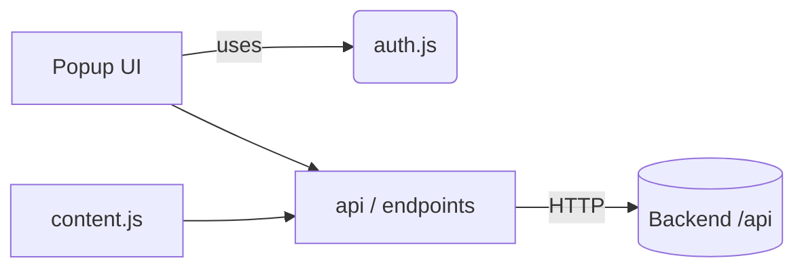

# Chrome Extension - AI SEO Ecosystem

A Chrome extension UI for authenticating and calling the backend API to run SEO agents from any webpage.

## 🚀 Quick Start

### Install (Unpacked)
1. Open Chrome → More Tools → Extensions
2. Enable "Developer mode"
3. Click "Load unpacked"
4. Select the `chrome-extension/` directory

No build step required.

### Configuration
The extension reads configuration from `chrome-extension/config.js`.

```js
const CONFIG = {
  // Toggle environment
  IS_PRODUCTION: true,

  // Production API URL
  PRODUCTION_API_URL: 'https://ai-seo-ecosystem.onrender.com/api',

  // Optional: Development API URL (when IS_PRODUCTION is false)
  // API_URL: 'http://localhost:3001/api'
};
```

- For local development, set `IS_PRODUCTION: false` and define `API_URL` (e.g., `http://localhost:3001/api`).
- For production, set `IS_PRODUCTION: true` and configure `PRODUCTION_API_URL` to your deployed backend.

## 🔑 Authentication
- Email/password login and signup flow uses backend endpoints:
  - `POST /auth/signup`
  - `POST /auth/signin`
  - `GET /auth/me`
- JWT token is stored in `chrome.storage.local`.

## 🧭 Architecture



## 🌐 Hosting
- Extension: Loaded locally via "Load unpacked" or can be published to Chrome Web Store.
- Backend: Currently configured for `https://ai-seo-ecosystem.onrender.com/api` (Render). For local dev, use `http://localhost:3001/api`.
- Frontend: Optional companion UI (Next.js) on `http://localhost:3000`.

## 🧩 Features
- Login / Signup with backend
- Configurable API base URL (dev/prod)
- Calls backend endpoints from the popup and content scripts

## 🧪 Testing
- Open the extension popup and try login/signup
- Open DevTools → Console to view logs

## 📁 Folder Structure

```
chrome-extension/
├── manifest.json      # Extension manifest (permissions, scripts)
├── popup.html         # Popup UI
├── popup.js           # Popup logic
├── auth.js            # Auth and token storage utilities
├── config.js          # Environment configuration (dev/prod URLs)
├── content.js         # Content script (runs in page context)
├── content.css        # Styles for content script
├── background.js      # (Optional) Background script
└── icons/             # Extension icons
```

## ⚙️ Permissions
- `storage` (for auth token)
- `activeTab` (if interacting with page content)
- `scripting` (if injecting content)

## ❗ Notes
- If the popup shows network errors, verify the API URL in `config.js` and ensure the backend is reachable.
- For CORS-related issues on dev, confirm the backend allows the extension origin in CORS config.
