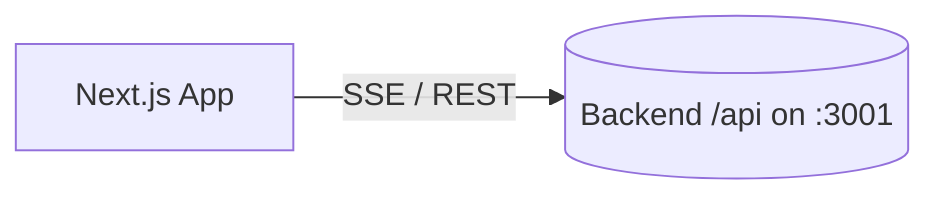

# Frontend - AI SEO Ecosystem

Next.js frontend for the AI Multi-Agent SEO Ecosystem.

## 🚀 Quick Start

### Installation

```bash
cd frontend
npm install
```

### Running

```bash
# Development mode
npm run dev

# Production build
npm run build

# Start production server
npm start
```

The frontend will run on `http://localhost:3000` (or automatically use the next available port)

## 📁 Structure

```
frontend/
├── app/
│   ├── components/      # React components
│   │   ├── AgentSelection.tsx
│   │   ├── ProgressSection.tsx
│   │   └── ResultsSection.tsx
│   ├── lib/             # Utilities and constants
│   │   └── constants.ts
│   ├── globals.css      # Global styles
│   ├── layout.tsx        # Root layout
│   └── page.tsx         # Main page
├── next.config.js       # Next.js configuration
├── tailwind.config.js   # Tailwind CSS configuration
├── tsconfig.json        # TypeScript configuration
└── package.json
```

## 🎨 Features

- **Modern UI** with Tailwind CSS
- **Real-time Streaming** via Server-Sent Events
- **Agent Selection** with checkboxes
- **Progress Tracking** with live updates
- **Results Display** with expandable cards
- **TypeScript** for type safety
- **Responsive Design**

## 🔧 Configuration

### Backend API URL

The frontend connects to the backend API. Configure in `app/lib/constants.ts`:

```typescript
export const API_URL = process.env.NEXT_PUBLIC_API_URL || 'http://localhost:3001/api';
```

Or set environment variable:
```bash
NEXT_PUBLIC_API_URL=http://localhost:3001/api npm run dev
```

### Port

Next.js automatically finds an available port. To set manually:
```bash
PORT=3001 npm run dev
```

## 🎯 Usage

1. Make sure the backend is running on `http://localhost:3001`
2. Start the frontend: `npm run dev`
3. Open `http://localhost:3000` (or the port shown in terminal)
4. Enter a URL or sitemap URL
5. Select agents to run
6. Click "Start Analysis"
7. Watch real-time progress!

## 📦 Build for Production

```bash
npm run build
npm start
```

## 🐛 Troubleshooting

### Can't Connect to Backend
- Verify backend is running: `http://localhost:3000/health`
- Check `app/lib/constants.ts` has correct API URL
- Check browser console (F12) for errors

### Port Conflicts
- Next.js will automatically use the next available port
- Or set `PORT` environment variable

### TypeScript Errors
- Run `npm install` to ensure all types are installed
- Check `tsconfig.json` is present

## 📝 Notes

- Uses Next.js 14 with App Router
- TypeScript for type safety
- Tailwind CSS for styling
- Server-Sent Events for real-time updates

## 🗺️ Architecture



## 🔧 Environment Example

Create `.env.local` in `frontend/` (or set env inline):

```bash
NEXT_PUBLIC_API_URL=http://localhost:3001/api
```

## 🌐 Hosting
- Local development: `next dev` on `http://localhost:3000`
- Recommended production hosting: Vercel (configure `NEXT_PUBLIC_API_URL` to your backend URL)

